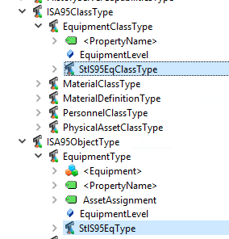

# Enterprise Equipment and Systen Control Diagram (SCD) function block types

These types are implemented and used to transform and harmonize diverse information coming from multiple OPC UA sources on the plant containing different information models. OPC UA gives each company high degree of freedom in how to structure the OPC UA address space, and as long as standardized OPC UA information models are not used in the industry, each company will define and describe similar type of information differently in each OPC UA server. These OPC UA types are instantiated in the Enterprise semantic layer where a unified asset hierarcy is constructed to be used by higher-level business applications and decision support systems.

The types in this NodeSet XML file is subtyped from the ISA-95 OPC UA Companion Specification (https://github.com/OPCFoundation/UA-Nodeset/tree/master/ISA-95) so in order to use our published information model you first need to create a namespace and import the ISA-95 NodeSet XML file. We have used the ISA-95 equipment object model which means that our types are subtyped from *EquipmentClassType* and *EquipmentType*. If you want to better understand the ISA-95 equipment object model and the concept of *EquipmentClass*, read IEC 62264 Part 1 (https://www.iso.org/standard/57308.html) and IEC 62664 Part 2 (https://www.iso.org/standard/57310.html). To understand how this concept is mapped to OPC UA, take a look at ISA-95 OPC UA companion specification (https://opcfoundation.org/developer-tools/specifications-opc-ua-information-models/isa-95-common-object-model/). 

The naming and underlying structure on some of the equipment types are inspired from ISO 14224 (https://www.iso.org/standard/64076.html) Annex A (Equipment-class attributes). This NodeSet XML file is not a formal and compliance-based implementation of ISO 14224. 

This NodeSet XML file also includes all SCD function blocks with output terminals and parameters as defined in IEC 63131 Annex A.4 (IEC PAS 63131:2017 System control diagram https://webstore.iec.ch/publication/60599 - Copyright © 2017 IEC Geneva, Switzerland. IEC has no responsibility for the placement and context in which the publication is used, nor is IEC in any way responsible for the other content or accuracy therein.)

Standards like ISO 14224 and IEC 63131 have no OPC UA companion specification available as NodeSet XML files that companies can use. Equinor has started going in this direction by manually implementing parts of these standards in OPC UA, and we hope that we as an industry together can realize joint companion specification out of this.

## Improvements

There are always room for improvement:

* Ideally, the IEC 63131 SCD function block types should be separated into a namespace that is independent of the ISA-95 OPC UA companion specification. We encourgage the community to further improve this and share back. 
